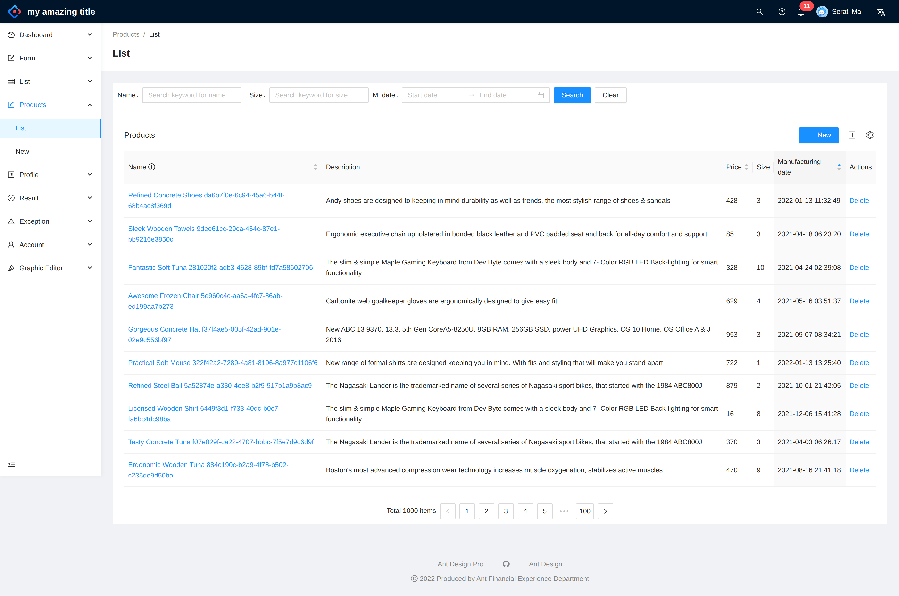
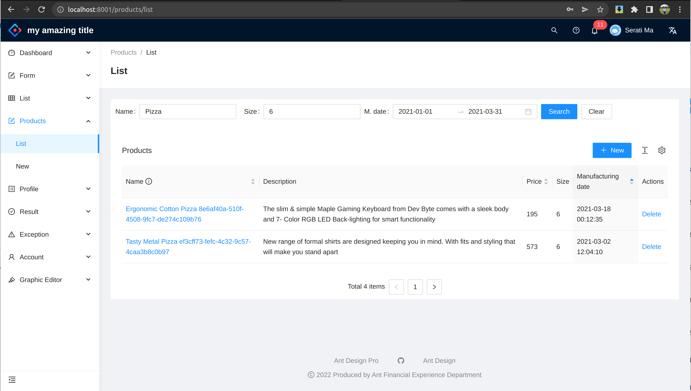
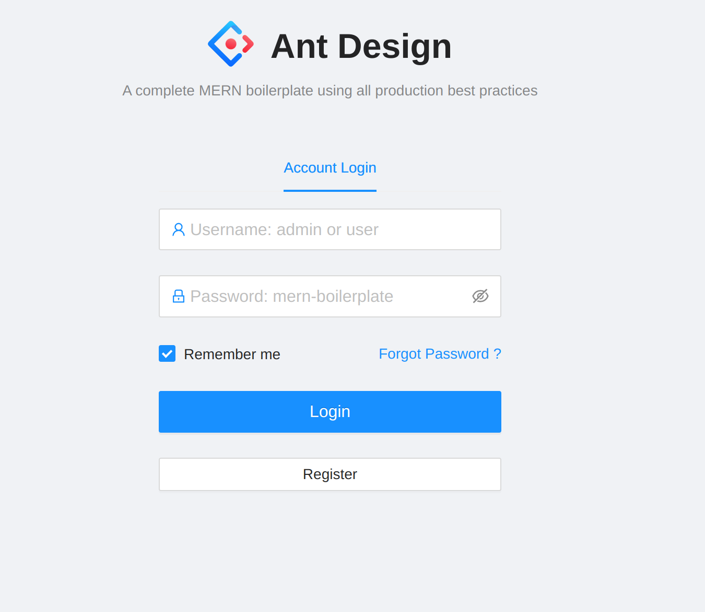
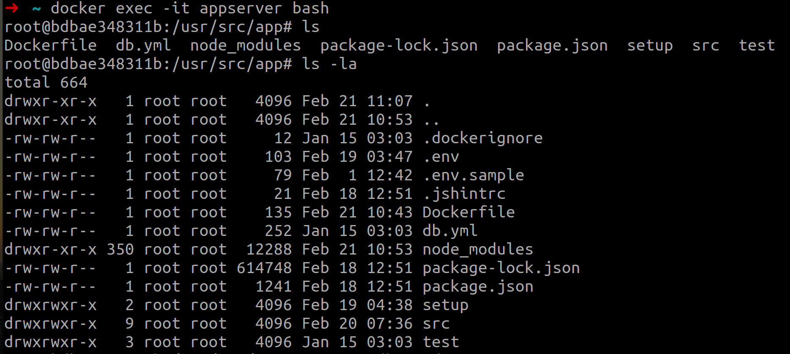
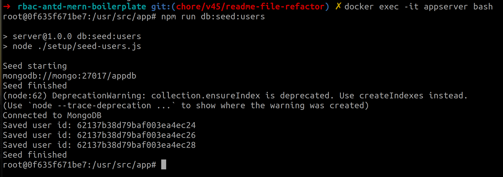
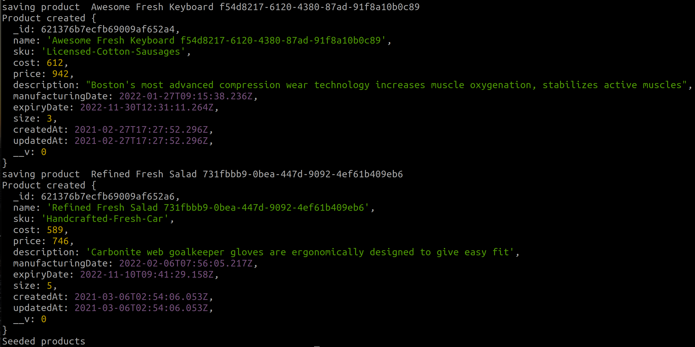
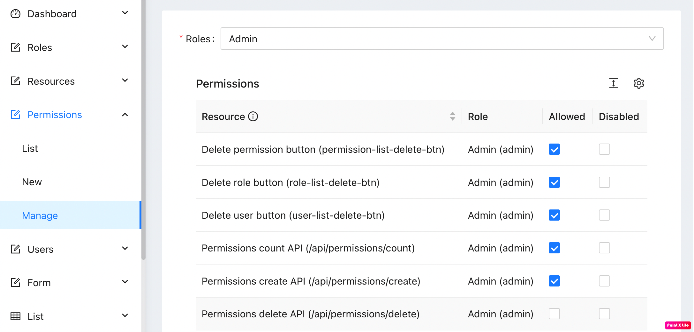

# Special thanks to the owner of the [boilerplate](https://github.com/foyzulkarim/mernboilerplate), Foyzul Karim
# Welcome to the RBAC MERN Boilerplate project

### _A complete (Work in progress now) MERN boilerplate repository with RBAC feature, following all production best practices._

In this repository I will keep adding the production best practices we should follow in a MERN (MongoDB, Express.js, React.js, and Node.js) project. Also for better UX I am using Antd Pro for the UI. May be later I will use MUI as well.

Below are the sample of a sample list page:





## Technology stack

As the name suggests, this repository is built on top of Express.js and React.js, however in the implementation detail, we will find other supporting technologies as well.

#### Client side

- React - A JavaScript library for building user interfaces
- Ant Design Pro - A design system for enterprise-level products. Create an efficient and enjoyable work experience
- Testing Library - React Testing Library
- Umi Request - HTTP client for the executing HTTP request from browser to server.

#### Server side

- Node.js - evented I/O for the backend
- Express.js - Fast, unopinionated, minimalist web framework for Node.js
- MongoDB - The application data platform for NoSQL databases
- Mongoose - mongoose
- Swagger - Swagger (Not done yet)
- Jest - JavaScript testing framework
- Super Test - Super test API testing framework

Details frameworks and packages can be found in the package.json files in server and client directory.

## Running the application

This project can be run basically in two ways. One is using docker, other way is to run manually via vscode.

### Docker

Depending on the MongoDB hosting option, we choose the appropriate docker-compose file.

#### Docker compose files

Currently we have two docker-compose files:

- `docker-compose.mongocloud.yml` - MongoDB.com hosted cluster
- `docker-compose.yml` - Local MongoDB container

##### Notes

1. We need to change the `MONGODB_CLOUD_URL` in `docker-compose.mongocloud.yml` to the appropriate MongoDB URL.
2. We need to change the `REACT_APP_API_URL` in `docker-compose.yml` to the appropriate API URL. If we want to expose our client to the internet, we need to change the `REACT_APP_API_URL` to the appropriate API URL. Otherwise keep `REACT_APP_API_URL` as `http://localhost:8002`.

**Run docker-compose commands**

It is expected that the machine must have docker and docker-compose installed. Go to the root of the repository and execute appropriate commands. This will spin up the server and client containers along with the MongoDB container (if we are using local MongoDB server) inside of Docker environment.


**Using docker containers with cloud hosted MongoDB**

```sh
> cd project-root
> docker-compose -f docker-compose.mongocloud.yml build
> docker-compose -f docker-compose.mongocloud.yml up
```

**Using docker containers with local MongoDB**
```sh
> cd project-root
> docker-compose build
> docker-compose up
```

The client and server both are up and running and we should see the following screen if we navigate to the client url.




- seed data
 Go inside of the docker container and execute below commands. These will seed the database with `roles`, `users` and `products` data.

  ```sh
  docker exec -it appserver bash
  npm run db:seed
  npm run db:migrate
  ```

  You should see the following output:
  

  
  
  

  You should be now login to the application and see the products list.

### Visual Studio Code

#### Prerequisites

- Node.js : To run npm packages
- MongoDB : As a database for the application

##### Steps

- To run via vscode, we should run the server and client side projects separately, and also make sure mongodb is up and running.
- Create a `.env` file inside of the `server` directory. Add the below entries or change accordingly. You can follow the `.env.sample` file to see the format.

  ```
  DB_HOST=localhost
  DB_PORT=27017
  DB_NAME=appdb
  JWT_SECRET=secret
  JWT_EXPIRES_IN=3600
  PORT=5000
  IS_MONGODB_CLOUD_URL=false
  MONGODB_CLOUD_URL=mongodb+srv:// <USER >: <PASSWORD >@cluster0.abcd.mongodb.net/myFirstDatabase?retryWrites=true
  ```

#### Server commands
We assume we run the MongoDB in the docker container.
```sh
cd server
npm i
npm run db:up
npm start
```

#### Client commands

```sh
cd client-pro
nvm use --lts
yarn
yarn start
```

## Data seeding

To seed the database, we need to run the following commands in the docker container. You can run these commands in the terminal as well if you are running the server and client outside of the docker environment.
I assume we are running appserver in the docker container.

```sh
docker exec -it appserver bash
npm run db:seed
npm run db:migrate
```

You should be able to see the username and password in the `/server/setup/users.json` file.

## Permission management ui 

I have introduced a permission management ui for the application. Sample image is given below.

  


### Centralized log to `Sentry.io`

We can also send the logs to [sentry.io](https://sentry.io). To use this feature, we need to add the `dsn` entry into `client/src/env.config.js`.
Setup snippet is like below in `index.js` file

```javascript
Sentry.init({
  dsn: Config.dsn,
  integrations: [new Integrations.BrowserTracing()],
  tracesSampleRate: 1.0,
});
```

## ~~Test `server` API~~ (NOT DONE YET)

~~To view the api, open your browser and visit `http://localhost:5000/api-docs`
Ideally we should add all of the API endpoints into the swagger, but for the demo purpose, we only added Products API endpoint.  
To test the APIs, we can reuse the postman collection. Open `docs/rbac-mern-boilerplate.postman_collection.json` into [Postman](https://www.postman.com/) and you should see the endpoints with appropriate payloads.~~

## Scripts

| Project | Command           | Task                                                 |
| ------- | ----------------- | ---------------------------------------------------- |
| root    | `npm run build`   | Builds the containers                                |
| root    | `npm run start`   | Start the projects and database in docker containers |
|root|`docker exec -it appserver  /bin/sh` then `npm run db:seed`|Executes seed products inside container|
| server  | `npm i`           | Install server side dependencies                     |
| server  | `npm run db:up`   | Start the database in a docker container             |
| server  | `npm run test`    | Execute tests using `jest`                           |
| client  | `npm i`           | Install client side dependencies                     |
| client  | `npm run start`   | Start the react app                                  |
| client  | `npm run build`   | Build the react app in production mode               |
| client  | `npm run test`    | Execute tests using `Testing Library`                |

## Types of testing

In this repository, we have included both unit testing and integration testing. For now, the code coverage is very low, but we are working on it to make it more than 90% somewhere in the future

### Client side

- We incorporated only unit tests in client side, and mock all the externals dependencies like `localStorage` and `axios`.

To run the tests, we can run `npm run test` command.

### Server side

- Integration testing: We have integrated the `Jest` as the testing library, and we have added `supertest` and `mongodb-memory-server` packages to make the integration testing easier.
- Unit testing: We have used `Jest` to test the service layers and mock the external dependencies like `MongoDB`.

To run the tests, we can run `npm run test` command.

## License

This project is [MIT licensed](https://github.com/facebook/react/blob/main/LICENSE).

[//]: # "These are reference links used in the body of this note and get stripped out when the markdown processor does its job. There is no need to format nicely because it shouldn't be seen. Thanks SO - http://stackoverflow.com/questions/4823468/store-comments-in-markdown-syntax"
[node.js]: http://nodejs.org
[express.js]: http://expressjs.com
[docker]: https://www.docker.com
[react]: https://reactjs.org/
[mongodb]: https://www.mongodb.com/
[ant design]: https://ant.design/
[testing library]: https://testing-library.com/
[styled components]: https://styled-components.com/
[axios]: https://github.com/axios/axios
[mongoose]: https://mongoosejs.com/
[swagger]: https://swagger.io/
[jest]: https://jestjs.io/
[super test]: https://github.com/visionmedia/supertest


## Contribution 
For now, I am not taking any community contritutions in terms of code.  But if you have any suggestions or you found any bugs, please feel free to open an issue or a pull request.

On the other hand, if you want to know something, or want to start a discussion about this  project, please start a discussion in our GitHub's discussion board.

## Tutorials about how to build or use this project

I have been screen recording the coding steps of this project. You can find the videos in the [YouTube playlist](https://www.youtube.com/playlist?list=PLEYpvDF6qy8aUl1KnB1oaZbwLE2oPcZmz). These  videos are only in **Bangla**, but I am happy to take special dedicated+paid sessions in English for international intersted audience. Feel free to reach out to me at foyzulkarim@gmail.com for any kind of help.

Thanks. Cheers.